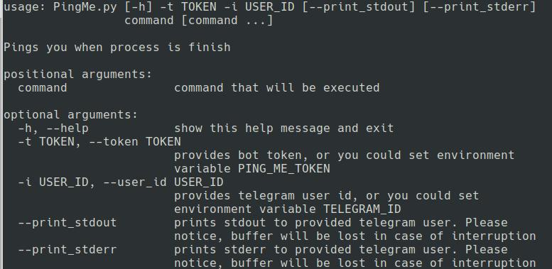

# Ping-me-when-you-are-finish
Telegram bot will ping you when the bash process finishes. Provided token and id by command-line argument will be preferred to the environmental variable.

## Requirements:
PyTelegramBotAPI\
argparse

## Usage

## Example
> ./PingMe.py -t $(TOKEN) -i $(TELEGRAM_ID) bash x.sh --print_stdout

